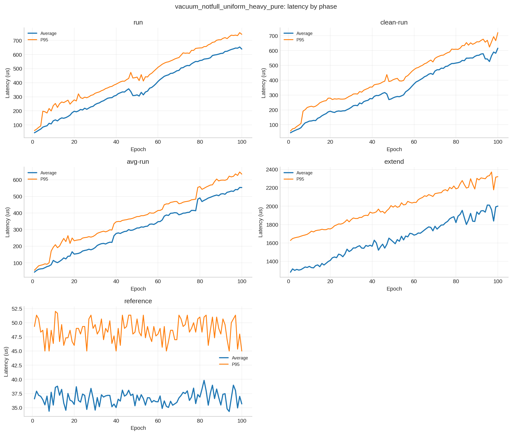
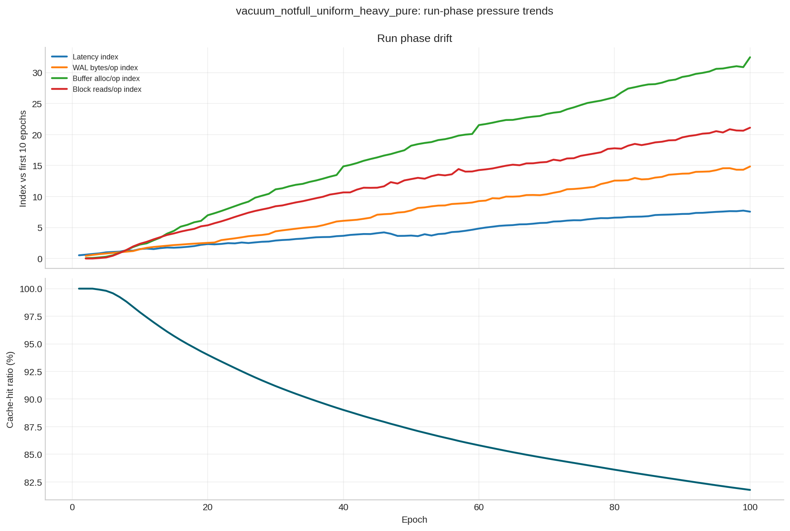
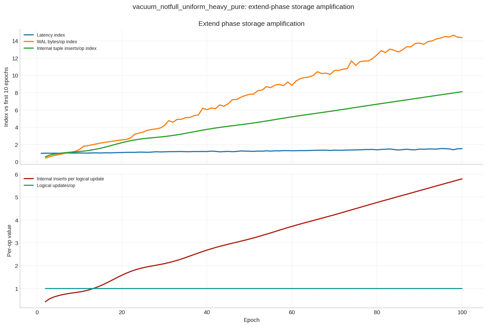
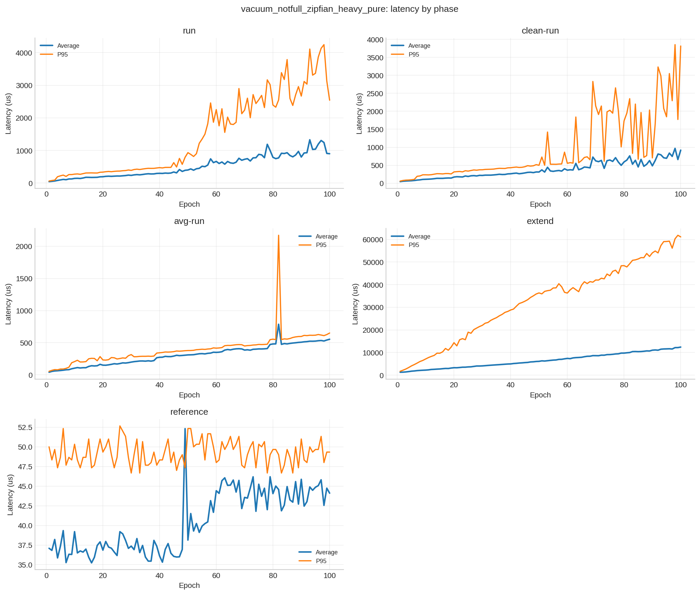
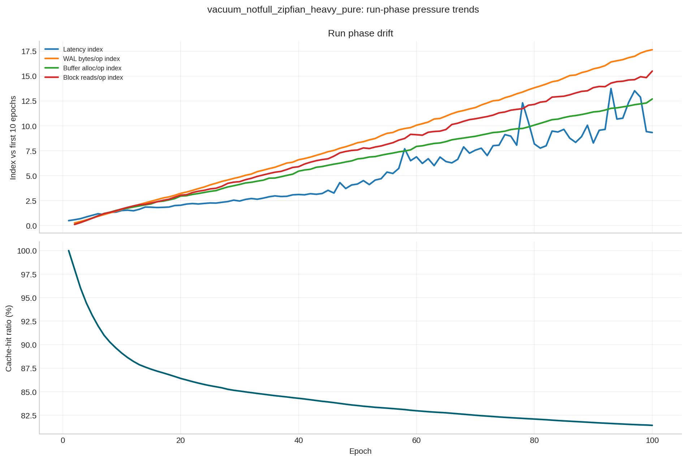
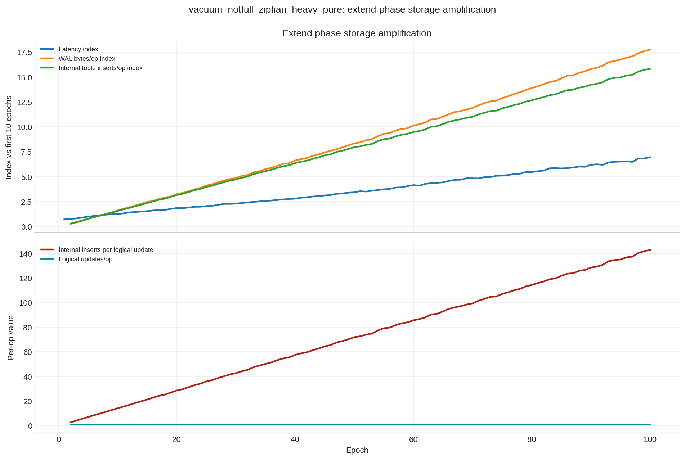

# PostgreSQL ArrayJSON Latency Increase Report

## Scope

This report analyzes the six PostgreSQL `arrayjson` CSVs:

-   `DATA/postgresql_arrayjson_vacuum_notfull_run1_uniform_heavy_pure.csv`
-   `DATA/postgresql_arrayjson_vacuum_notfull_run1_zipfian_heavy_pure.csv`
-   `DATA/postgresql_arrayjson_vacuum_notfull_run2_uniform_heavy_pure.csv`
-   `DATA/postgresql_arrayjson_vacuum_notfull_run2_zipfian_heavy_pure.csv`
-   `DATA/postgresql_arrayjson_vacuum_notfull_run3_uniform_heavy_pure.csv`
-   `DATA/postgresql_arrayjson_vacuum_notfull_run3_zipfian_heavy_pure.csv`

Repeated phases analyzed:

-   `run`
-   `clean-run`
-   `avg-run`
-   `extend`
-   `reference`

The counters are cumulative, so the report uses same-phase epoch deltas normalized by `Operations` to estimate per-operation pressure.

## Executive Summary

-   The latency increase is real and severe in both scenarios, but it is much worse under `zipfian` access, especially for `extend`.
-   The most consistent long-run drivers are rising `WAL bytes/op`, `WAL records/op`, `buffer allocs/op`, and block-access intensity, alongside a falling cache-hit ratio.
-   The clearest mechanism is storage amplification during `extend`: logical updates stay close to one tuple per op, but internal tuple inserts per logical update climb sharply over time.
-   This pattern is consistent with growing `arrayjson` values forcing more internal PostgreSQL work per logical extend. That is an inference from the counters, but it matches the observed WAL and buffer growth very closely.
-   The read phases then get slower because the amount of data touched per read rises dramatically. In `run`, tuples fetched/op and block reads/op grow by multiples, not just a few percent.

## Phase Drift Summary

| Scenario | Phase | Avg latency first10 us | Avg latency last10 us | Avg latency change % | Throughput first10 | Throughput last10 | Throughput change % |
|---------|---------|---------|---------|---------|---------|---------|---------|
| vacuum_notfull_uniform_heavy_pure | avg-run | 72.20 | 533.39 | 639.7 | 13,908.11 | 1,865.27 | -86.6 |
| vacuum_notfull_uniform_heavy_pure | clean-run | 83.03 | 569.10 | 587.6 | 12,727.70 | 1,766.16 | -86.2 |
| vacuum_notfull_uniform_heavy_pure | extend | 1,317.25 | 1,956.41 | 48.6 | 754.93 | 511.58 | -32.2 |
| vacuum_notfull_uniform_heavy_pure | reference | 36.52 | 36.53 | 0.0 | 24,447.10 | 24,482.52 | 0.1 |
| vacuum_notfull_uniform_heavy_pure | run | 84.54 | 634.53 | 658.0 | 12,496.21 | 1,567.49 | -87.4 |
| vacuum_notfull_zipfian_heavy_pure | avg-run | 72.36 | 529.26 | 631.8 | 13,866.20 | 1,883.17 | -86.4 |
| vacuum_notfull_zipfian_heavy_pure | clean-run | 75.94 | 775.90 | 948.8 | 13,440.83 | 1,360.76 | -89.7 |
| vacuum_notfull_zipfian_heavy_pure | extend | 1,785.89 | 11,694.31 | 554.3 | 578.92 | 85.86 | -85.2 |
| vacuum_notfull_zipfian_heavy_pure | reference | 37.17 | 44.20 | 18.9 | 24,073.23 | 20,423.82 | -15.1 |
| vacuum_notfull_zipfian_heavy_pure | run | 96.71 | 1,081.62 | 1,062.1 | 11,267.04 | 1,003.04 | -90.9 |

## Most Consistent Long-Run Drivers

| Scenario | Phase | Driver | Latency rho | Throughput rho |
|---------------|---------------|---------------|---------------|---------------|
| vacuum_notfull_uniform_heavy_pure | run | Internal inserts/logical update | 0.995 | -0.994 |
| vacuum_notfull_uniform_heavy_pure | run | Internal tuple inserts/op | 0.995 | -0.994 |
| vacuum_notfull_uniform_heavy_pure | run | Tuples fetched/op | 0.994 | -0.994 |
| vacuum_notfull_uniform_heavy_pure | clean-run | WAL records/op | 0.988 | -0.988 |
| vacuum_notfull_uniform_heavy_pure | clean-run | WAL bytes/op | 0.988 | -0.988 |
| vacuum_notfull_uniform_heavy_pure | clean-run | Buffer allocs/op | 0.988 | -0.988 |
| vacuum_notfull_uniform_heavy_pure | avg-run | WAL records/op | 0.998 | -0.998 |
| vacuum_notfull_uniform_heavy_pure | avg-run | WAL bytes/op | 0.997 | -0.997 |
| vacuum_notfull_uniform_heavy_pure | avg-run | Buffer allocs/op | 0.996 | -0.996 |
| vacuum_notfull_uniform_heavy_pure | extend | Cleaner buffers/op | 0.979 | -0.979 |
| vacuum_notfull_uniform_heavy_pure | extend | Block reads/op | 0.976 | -0.976 |
| vacuum_notfull_uniform_heavy_pure | extend | WAL bytes/op | 0.975 | -0.974 |
| vacuum_notfull_zipfian_heavy_pure | run | Tuples fetched/op | 0.979 | -0.979 |
| vacuum_notfull_zipfian_heavy_pure | run | WAL bytes/op | 0.979 | -0.979 |
| vacuum_notfull_zipfian_heavy_pure | run | Tuples returned/op | 0.979 | -0.979 |
| vacuum_notfull_zipfian_heavy_pure | clean-run | WAL bytes/op | 0.972 | -0.972 |
| vacuum_notfull_zipfian_heavy_pure | clean-run | WAL records/op | 0.972 | -0.972 |
| vacuum_notfull_zipfian_heavy_pure | clean-run | Buffer allocs/op | 0.972 | -0.972 |
| vacuum_notfull_zipfian_heavy_pure | avg-run | WAL records/op | 0.995 | -0.995 |
| vacuum_notfull_zipfian_heavy_pure | avg-run | WAL bytes/op | 0.995 | -0.995 |
| vacuum_notfull_zipfian_heavy_pure | avg-run | Buffer allocs/op | 0.995 | -0.995 |
| vacuum_notfull_zipfian_heavy_pure | extend | Internal inserts/logical update | 0.999 | -0.999 |
| vacuum_notfull_zipfian_heavy_pure | extend | Internal tuple inserts/op | 0.999 | -0.999 |
| vacuum_notfull_zipfian_heavy_pure | extend | Tuples fetched/op | 0.999 | -0.999 |

Interpretation:

-   The dominant pattern is cumulative pressure, not a single isolated checkpoint spike.
-   `run`, `clean-run`, and `avg-run` all track the same family of drivers: more WAL, more buffer allocation churn, and more block work per logical operation.
-   `reference` is the exception. It stays mostly flat in `uniform` because its read pressure barely changes, which is useful evidence that the worst latency growth is tied to the active extend-driven workload rather than an unrelated global slowdown.

## Extend Storage Amplification

| Scenario | Logical updates/op first10 | Logical updates/op last10 | Internal tuple inserts/op first10 | Internal tuple inserts/op last10 | Internal inserts per logical update first10 | Internal inserts per logical update last10 | WAL bytes/op first10 | WAL bytes/op last10 |
|--------|--------|--------|--------|--------|--------|--------|--------|--------|
| vacuum_notfull_uniform_heavy_pure | 1.000 | 1.000 | 0.697 | 5.570 | 0.696 | 5.568 | 3,820.4 | 59,780.2 |
| vacuum_notfull_zipfian_heavy_pure | 1.000 | 1.002 | 8.327 | 136.475 | 8.323 | 136.162 | 24,192.8 | 446,236.9 |

Why this matters:

-   In `uniform`, `extend` stays near `1.00 -> 1.00` logical tuple updates/op, but internal tuple inserts rise from `0.70` to `5.57` per op.
-   In `zipfian`, the same signal is much stronger: internal tuple inserts rise from `8.33` to `136.47` per op while logical updates stay near one.
-   WAL bytes/op rise from about `3820` to `59780` in `uniform`, and from `24193` to `446237` in `zipfian`.
-   Because there are no user-level INSERT phases in these repeating workloads, the rising internal insert counter is best read as PostgreSQL doing extra storage work underneath each logical extend. The most plausible explanation is growing TOAST/storage chunk churn as the JSON arrays get larger.

## Run-Phase Read Amplification

| Scenario | Tuples returned/op first10 | Tuples returned/op last10 | Tuples fetched/op first10 | Tuples fetched/op last10 | Block reads/op first10 | Block reads/op last10 | Block hits/op first10 | Block hits/op last10 | Cache-hit ratio first10 | Cache-hit ratio last10 |
|-------|-------|-------|-------|-------|-------|-------|-------|-------|-------|-------|
| vacuum_notfull_uniform_heavy_pure | 13.07 | 80.29 | 12.28 | 79.60 | 1.22 | 30.62 | 54.12 | 96.90 | 0.994 | 0.822 |
| vacuum_notfull_zipfian_heavy_pure | 28.42 | 342.14 | 27.65 | 341.20 | 10.63 | 170.01 | 84.58 | 681.72 | 0.934 | 0.815 |

Interpretation:

-   In `uniform` run phases, tuples fetched/op rise from `12.28` to `79.60` and block reads/op rise from `1.22` to `30.62`.
-   In `zipfian` run phases, tuples fetched/op rise from `27.65` to `341.20` and block reads/op rise from `10.63` to `170.01`.
-   That means the read path is paying for much larger or more fragmented state later in the run, which lines up with the storage-amplification story above.

## Figures

### Uniform Scenario

### Zipfian Scenario

## Bottom Line

-   The latency increase is mainly explained by cumulative storage and write amplification as the `arrayjson` payloads grow over epochs.
-   The strongest evidence is the near-perfect long-run tie between latency and `WAL bytes/op`, `WAL records/op`, `buffer allocs/op`, and read/block intensity.
-   The extend phase appears to be the root of that drift: one logical update increasingly causes many more internal inserted tuples, which is consistent with PostgreSQL having to create more out-of-line storage chunks for larger JSON values.
-   Zipfian access makes the problem much worse because the hottest rows accumulate that storage growth fastest, so both extend latency and later read latency deteriorate more sharply.